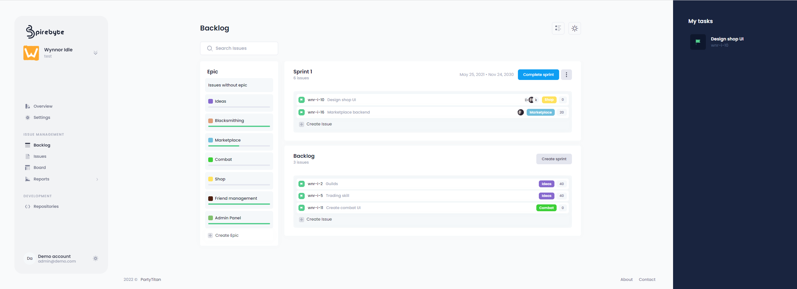

<!-- PROJECT LOGO -->
<br />
<p align="center">
  <a href="https://github.com/github_username/repo_name">
    
  </a>

  <div align="center">
    <h3>Spirebyte project management</h3>
  </div>

  <p align="center">
    A scumboard made with microservices
    <br />
    <br />
    <a href="https://spirebyte.jordihuntjens.nl">View Demo (Not yet published as of 10/12/2020)</a>
  </p>
</p>

<!-- TABLE OF CONTENTS -->
## Table of Contents

* [About the Project](#about-the-project)
  * [Built With](#built-with)
* [Getting Started](#getting-started)
  * [Prerequisites](#prerequisites)
  * [Installation](#installation)
* [Usage](#usage)


<!-- ABOUT THE PROJECT -->
## About The Project




There are many scrum boards out there. However, this is the only one created by me. This project was created as a learning experience in the field of microservices. And I dare say it is turning out pretty well.


### Built With

* [ASP.NET Core](https://dotnet.microsoft.com/learn/aspnet/what-is-aspnet-core)
* [Angular](https://angular.io/)
* [Convey](https://convey-stack.github.io/)
* [Ntrada](https://github.com/snatch-dev/Ntrada)
* [Metronic](https://keenthemes.com/metronic/)


<!-- GETTING STARTED -->
## Getting Started

To get a local copy up and running follow these simple steps.

### Prerequisites

This is an example of how to list things you need to use the software and how to install them.
* npm
```sh
npm install npm@latest -g
```
* .NET Core 3.1
```sh
https://dotnet.microsoft.com/download/dotnet-core/3.1
```
* Docker
```sh
https://www.docker.com/
```


### Installation

1. Clone the repo
```sh
git clone https://git.jordihuntjens.nl/scm/s3pp/spirebyte.git
```
2. Run infrastructure services in `Spirebyte/compose` directory
```sh
docker-compose -f infrastructure.yml up -d
```
3. Install NPM packages
```sh
npm install
```
4. Run local services in `Spirebyte/compose` directory
```sh
docker-compose -f services-local.yml up
```

<!-- USAGE EXAMPLES -->
## Usage

This project can be used to document any agile project.
